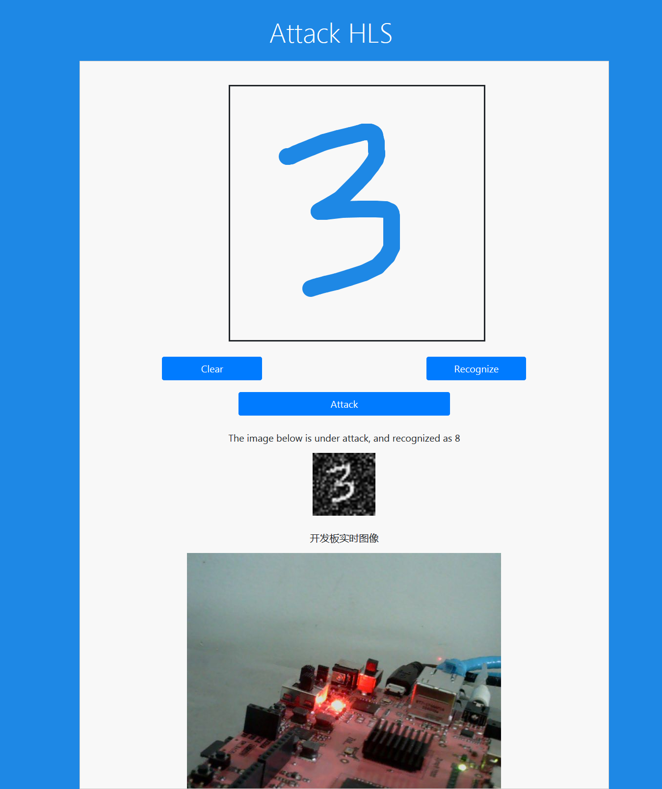

Attack HLS
====

> 不少应用利用 HLS 在 Xilinx Zynq 系列芯片上部署深度学习模型，然而深度学习的模型如果容易受到攻击，对应的 HLS 实现也会受到攻击，这是一个 Lenet-5 HLS 受到 Hopskipjump 攻击的演示应用。

## Introduction

现在深度学习因为高精度被得到广泛应用，但是很多时候模型被当做黑匣子，只要准确度高，模型根据什么做出预测并没有得到太大关注。

但是近几年研究发现深度学习模型非常容易受到攻击，从人眼来看图像没有发生任何变化，但是深度学习模型会做出错误的判断。

## Implementation

## Related Projects

- Black-Box Attack:

    https://github.com/Trusted-AI/adversarial-robustness-toolbox

- Lenet (Python):

    https://github.com/wuhanstudio/attack-hls

- Lenet (HLS):

    https://github.com/a2824256/HLS-LeNet  
https://github.com/Xilinx/finn-hlslib